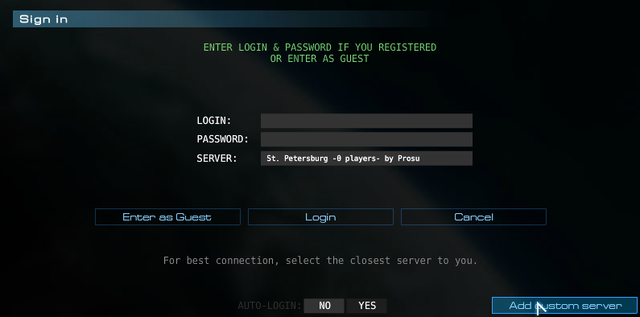
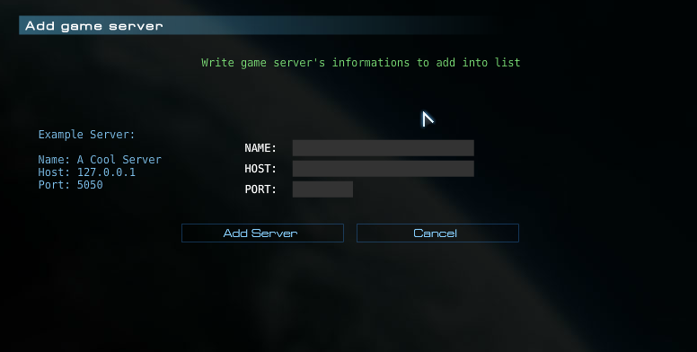
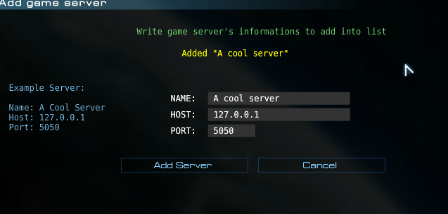
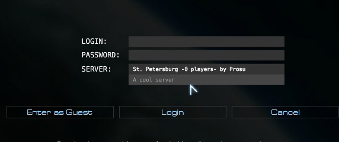

# !! THIS IS NOT FULL OPEN SOURCE OF PB2_MP REPOSITORY. !!
There were codes that interfaced with PB2 server directly. <br>
This repository only includes codes that does NOT have it.

# PB2Works Expanded PB2 Multiplayer Server
This is repository where MP server code is hosted on. The game server is responsible for basically everything that happens inside the MP, from login, match creation, match joining, to handling in-game packets.

So if you want to selfhost, you need a [nim compiler](https://nim-lang.org/). Heads up: if windows defender flags this file, it is false positive.

So start by cloning the repository. Or downloading the repository.
Then copy `sconfig.example.nim` and paste as `sconfig.nim`.

```nim
const config* = (
    authorityServer: (
        secure: false,
        host: "127.0.0.1:36322", # Empty if not using.
        apiKey: "API key here",
        serverName: "Nim Server",
    ),
    host: "127.0.0.1",
    port: 36320,
    udpEnabled: false,
    serverTriggerEnabled: true,
    guestsEnabled: false,
)
```
Now let's go over what those mean: <br>

`authorityServer` means Webserver to connect to. This webserver is called "authority" because it has information about users. This same webserver is also where game servers learn about loginning clients.

Essentially, client sends request to authoritative webserver, who gives token to client, client then sends that token to game server, who then sends to authoritative webserver, the webserver then responds with information about users, such as login, display, flags, skins.

This webserver is also responsible for displaying default servers in MP screen.
You can use different authority servers, but it will be useless if client uses default authority server, changing it requires swf modification.

`authorityServer.secure` indicates whether to use secure protocol or not. Essentially WSS or WS.

`authorityServer.host` indicates webserver's IP and port. Set to empty if you don't want to connect to authority webserver at all.

`authorityServer.apiKey` api key to use when connecting to webserver, this is only require if you want server to be listed publicly. If you want API key, you need to ask authority webserver provider.

`authorityServer.serverName` indicates name of this game server that will appear in display list. Requires `authorityServer.apiKey` to be any use.

Now every other key:
`host` and `port` indicate where game server should bind to. `127.0.0.1` means local machine, `0.0.0.0` means other people can connect to game server from same machine, from same network, or from internet. Port can be any number that is free.

`udpEnabled` indicates whether to allow clients to connect to matches over UDP protocol. This is not useful if you are using default client as default client has it disabled. (We had bugs implementing it, so we decided to fallback to TCP for time being). Requires swf modification to be any use.

`serverTriggerEnabled` indicates whether to allow server-sided triggers to be ran inside server. Those are triggers that run in server rather than clients.

`guestsEnabled` indicates whether to allow guests. Disabling it will give `[SERVER] This server has guests disabled.` to clients trying to login as guest.

Once you have done that, now open command prompt in this directory and run this command:

`nim c -d:ssl game_server`

This shouldn't take too long, once it has finished, you now have `game_server.exe` in your directory, you can now run it. You can also redistribute it to other people and it'll run too if you wish, of course if you provide them with relevant DLLs.

## Connecting to game server from game
You'll be pleased to know that you don't need to modify swf to connect to your server from game. The game natively supports connecting to custom servers.





